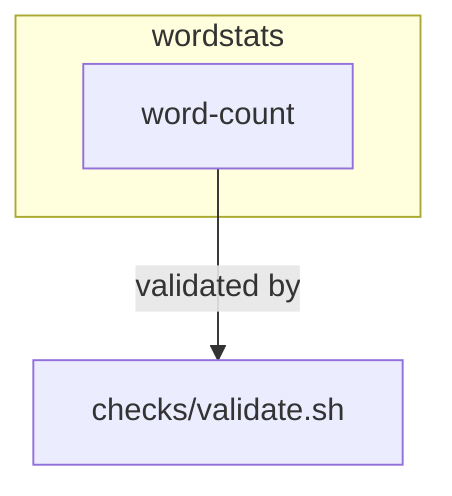

# wordstats - as-is

Benchmark seed fixture for the round-2 baseline workflow arm: a tiny Python word-count library and `count` CLI with deterministic validation. It exists only as fixture material, not as a live or promoted artifact.

**Lineage**: **wordstats**

## Components

| Component | Purpose | Record |
| --- | --- | --- |
| [word-count](src/wordstats/as-is.md#design) | Word-count library and `count` CLI surface | `src/wordstats/as-is.md` |

## Design

### Project context

The project root holds the `wordstats` package (`src/wordstats/`), focused unit tests (`tests/`), fixed smoke-check input (`sample-data/words.txt`), mock ownership records (`records/`), human-facing design notes (`docs/design-notes.md`), and `checks/validate.sh`, the deterministic validation entry point (compile check, unit tests, CLI smoke check against `checks/expected-count.json`; no network access, exits nonzero on the first failed check).

## Links

- `checks/validate.sh` — the smallest authoritative validation for any change here; run with `bash checks/validate.sh`.
- `records/ownership-map.md` — mock ownership records used to resolve change scope; unknown or ambiguous areas have no owner record and stop for direction.
