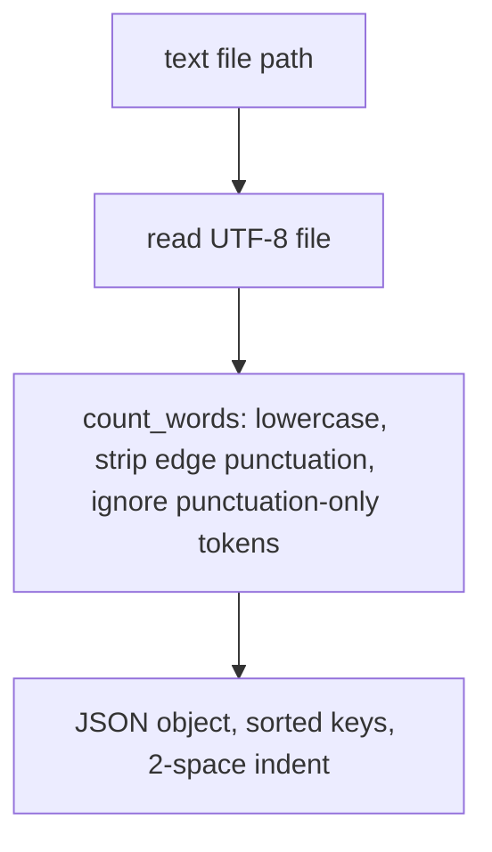

# word-count - as-is

Owns the word-count logic and the `count` CLI surface (`src/wordstats/`). Public contract: lowercase tokens, punctuation stripped from token edges, punctuation-only tokens ignored, counts returned as a mapping; the CLI prints a JSON object with sorted keys and 2-space indent.

**Lineage**: [wordstats](../../as-is.md) → **word-count**

## Design

### Count pipeline

`counter.py` holds `count_words`, a pure library function unit-tested in `tests/test_counter.py`. `cli.py` exposes the argparse `count` subcommand (`python -m wordstats.cli count <path>`) and is exercised by the CLI smoke check in `checks/validate.sh`. There is no `__main__.py`; the package has no runnable default entry point beyond the `count` subcommand.
