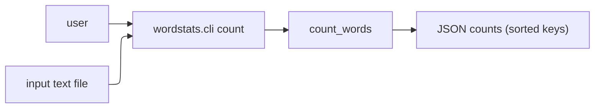

# wordstats - as-is

## Purpose

Provide the wordstats benchmark seed: a tiny word-count library and `count` CLI that reports word frequencies as sorted JSON, plus the deterministic validation that proves the seed works.

## Design

A single small Python package (`src/wordstats/`) exposes `count_words` (library) and a `wordstats.cli` argparse CLI with a required `count` subcommand. The CLI reads a UTF-8 text file, counts lowercase tokens with edge punctuation stripped, and prints a 2-space-indented JSON object with sorted keys. `checks/validate.sh` is the deterministic gate: compile check, unit tests, and a CLI smoke check diffed against `checks/expected-count.json`.

**Lineage**: **wordstats**

### Count command flow

## Relationships

- The seed exists only as benchmark fixture material; it has no runtime consumers outside its own validation.
- `README.md` is the reader-facing entry point and must agree with the actual CLI surface (`python3 -m wordstats.cli count`, with `PYTHONPATH=src`).

## Links

- `docs/design-notes.md` — records the design decision behind the `count` command output format.
- `records/ownership-map.md` — mock ownership records used to resolve change scope in this project.
