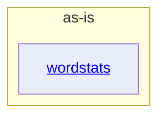

# as-is - as-is

## Purpose

Anchor for the wordstats benchmark seed project: a tiny word-count library and `count` CLI kept as fixed fixture material for workflow benchmarking, not a live or promoted artifact.

## Components

| Component | Purpose |
| --- | --- |
| [`wordstats`](src/wordstats/as-is.md#design) | Word-count library and `count` CLI surface. |

## Design

The project is a single Python package (`src/wordstats/`) plus test, validation, fixture, documentation, and ownership-record support material; no other component boundaries are approved.

**Lineage**: **as-is**

### Structural container

Support material outside the `wordstats` component: `tests/` (unit tests), `checks/` (deterministic validation via `checks/validate.sh`), `sample-data/` (fixed smoke-check input), `docs/` (design and setup notes), `records/` (mock ownership records). These have no independent component authority.

## Relationships

- `wordstats` is the only child component; the root mediates no external dependencies (the project is offline by design: no network access in validation).
- Ownership of source versus documentation artifacts is recorded in `records/ownership-map.md`, which stays the authority for change-scope resolution.