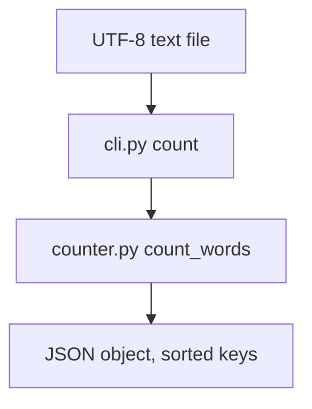

# wordstats - as-is

## Purpose

Provide word counting for UTF-8 text files: lowercase tokens with punctuation stripped from token edges, punctuation-only tokens ignored, counts returned as a mapping, and a `count` CLI that prints a JSON object with sorted keys.

## Design

`src/wordstats/` contains `counter.py` (the counting library) and `cli.py` (an argparse CLI whose only subcommand is `count <path>`); the package is run as `python3 -m wordstats.cli count <path>` with `src/` on `PYTHONPATH`.

**Lineage**: [as-is](../../as-is.md#design) / **wordstats**

### Count command flow

Output is deterministic for a fixed input; `checks/expected-count.json` pins the result for `sample-data/words.txt`.

## Relationships

- The core-utility owner record (`records/owners/core-utility.md`) states the public contract this component must honor; `README.md` and `docs/design-notes.md` are owned separately by the design-notes owner record.

## Links

- Core-utility owner record → [`../../records/owners/core-utility.md`](../../records/owners/core-utility.md) — the authoritative CLI and library contract for this component.