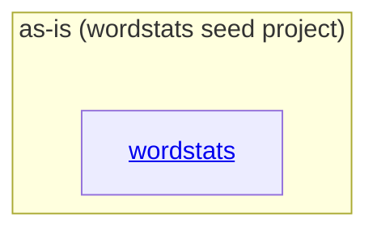

# as-is - as-is

## Purpose

Durable architecture context for the wordstats benchmark seed project: a tiny Python word-count library and `count` CLI with deterministic checks, mock ownership records, and human-facing design notes. The root record orients readers to the project's component map; each component record carries its own design detail.

## Components

| Component | Purpose |
| --- | --- |
| [`wordstats`](src/wordstats/as-is.md#design) | Word-count library and `count` CLI producing sorted JSON word frequencies. |

## Design

The project is a small single-component fixture: one Python package with a CLI surface, supported by tests, a deterministic check script, and mock ownership records that resolve change scope.

**Lineage**: **as-is**

### Project structure

| Concern | Disposition |
| --- | --- |
| `src/wordstats/` | Component (see `wordstats` record). |
| `tests/`, `checks/`, `sample-data/` | Project fixture material; validated by `checks/validate.sh`, no distinct ownership boundary. |
| `records/`, `docs/`, `README.md`, `CHANGELOG.md` | Project-level mock ownership and design records owned at the root. |
