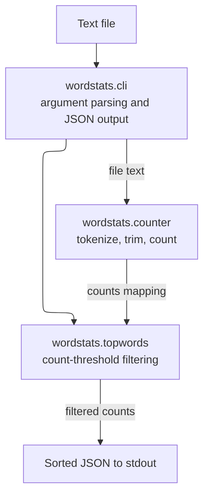

# wordstats - as-is

## Purpose

Owns the word-count logic and CLI surface: lowercased, punctuation-trimmed token counting and the `wordstats count` command that prints counts as sorted JSON.

## Design

The CLI parses arguments, reads the input file, and prints a JSON object mapping words to counts with sorted keys and 2-space indent. Tokenization and counting live in the counter module; count-policy helpers live beside it.

**Lineage**: [as-is](../../as-is.md#design) / **wordstats**

### Count pipeline

| Fact | Contract |
| --- | --- |
| Tokenization | Lowercase tokens, strip punctuation from token edges, ignore punctuation-only tokens. |
| Counting | Return a mapping of word to occurrence count. |
| CLI output | JSON object, keys sorted alphabetically, 2-space indent; exit 0 on success. |
| `--min-count N` | Positive integer; omits words with fewer than N occurrences; invalid N exits 2 with a clear message. |

## Relationships

- Owner record: `records/owners/core-utility.md` owns this component's logic and CLI surface.
- Project docs (`docs/design-notes.md`) record design decisions before behavior changes; the ownership map resolves change scope.
