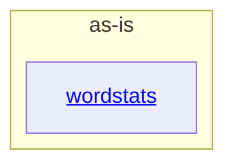

# as-is - as-is

## Purpose

Durable architecture context for the wordstats project: a tiny word-count library and `count` CLI with deterministic checks, fixture data, and project ownership records. This root record navigates readers to the project's components and their authoritative design context.

## Components

| Component | Purpose |
| --- | --- |
| [`wordstats`](src/wordstats/as-is.md#design) | Word-count logic and the `count` CLI surface. |

## Design

The project is a single Python package (`src/wordstats/`) surrounded by fixture data, a deterministic check harness, unit tests, and mock ownership records; the `wordstats` component owns all counting behavior and the CLI surface.

**Lineage**: **as-is**

### Structural container

- `checks/validate.sh` is the deterministic validation gate (compile, unit tests, CLI smoke check) for the whole project; it is project tooling, not a component.
- `records/ownership-map.md` resolves owner records and change scope for bounded changes; unresolvable scope stops for direction.
- `docs/design-notes.md` records human-facing design decisions; `CHANGELOG.md` records durable handoffs.
- `sample-data/words.txt` is the fixed input for the CLI smoke check.

## Links

- Owner and change-scope resolution → `records/ownership-map.md` — resolves owner records and change scope before bounded changes.
- Design-decision record → `docs/design-notes.md` — normative record of design decisions that bound changes to user-visible behavior.
