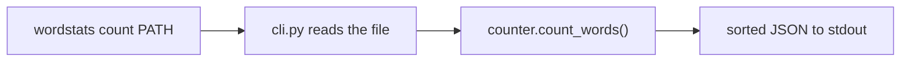

# wordstats count pipeline

This document explains how `wordstats count` turns a text file into word counts, for a new reader.

## Usage

```sh
PYTHONPATH=src python3 -m wordstats.cli count sample-data/words.txt
```

## Pipeline

1. `wordstats.cli` parses the `count PATH` arguments, opens `PATH` as a UTF-8 text file, and reads its contents.
2. `wordstats.counter.count_words()` lowercases the text, splits it on whitespace, strips the configured edge punctuation characters `.,;:!?-"'()` from each token, ignores tokens left empty after stripping, and counts the remaining words.
3. The CLI serializes the resulting mapping with `json.dumps(..., indent=2, sort_keys=True)` and prints it to stdout; the process exits 0 on success.

## Flow



## Contract notes

- Words are lowercased; only the edge punctuation characters above are stripped, so interior punctuation and other Unicode normalization are out of scope.
- Punctuation-only tokens (for example `--`) are ignored rather than counted.
- Output is a JSON object with alphabetically sorted keys and 2-space indentation, matching `checks/expected-count.json`.
- The counting and output contract is owned by `records/owners/core-utility.md`; the original design decision is recorded in `docs/design-notes.md`.