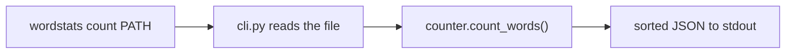

# wordstats - as-is

## Purpose

Counts words in text and exposes the result through the `wordstats count` CLI: lowercase whitespace-separated tokens with configured edge punctuation stripped, reported as sorted JSON on stdout.

## Design

`wordstats` is one small Python package with two cohesive units: `counter.count_words()` (pure counting logic, stdlib only, no external dependencies) and `cli.py` (argparse subcommand `count PATH`, UTF-8 file read, JSON serialization with `indent=2` and `sort_keys=True`, exit code 0 on success).

**Lineage**: [as-is](../../as-is.md#design) / **wordstats**

### Count pipeline flow

- `count_words()` lowercases, splits on whitespace, strips the configured edge punctuation characters `.,;:!?-"'()` from token edges, ignores tokens left empty after stripping, and returns a plain mapping.
- The public contract and ownership are normative in the linked owner record; `tests/` and `checks/validate.sh` exercise the contract but are not part of this component.

## Links

- Normative public contract → `../../records/owners/core-utility.md` — the owner record defining the counting and CLI output contract.
- Reader-facing pipeline documentation → `../../docs/pipeline.md` — explains the count pipeline for new readers.