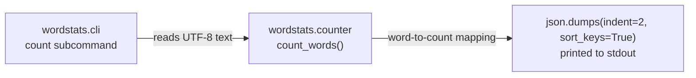

# Count pipeline

How `wordstats count` turns a text file into sorted JSON, for a new reader. The public contract is owned per `records/owners/core-utility.md`; the design decision behind the output format is recorded in `docs/design-notes.md`.

## Flow



1. The CLI (`src/wordstats/cli.py`) parses `wordstats count <path>`, opens `<path>` as UTF-8, and passes the file's text to the counter.
2. `count_words` in `src/wordstats/counter.py` lowercases the text, splits it into whitespace-separated tokens, strips punctuation from token edges (`. , ; : ! ? - " ' ( )`), ignores tokens that are only punctuation, and returns a mapping of each remaining word to its count.
3. The CLI serializes the mapping with `json.dumps(counts, indent=2, sort_keys=True)` and prints it, so keys come out alphabetically sorted in a stable, programmatically consumable order.

## Example

```sh
PYTHONPATH=src python3 -m wordstats.cli count sample-data/words.txt
```

prints the JSON object checked by `checks/expected-count.json` (see `checks/validate.sh`), e.g. `{"brown": 1, "dog": 1, "fox": 2, ...}`.
