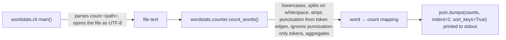

# Count pipeline

This note explains how the `wordstats count` command turns a text file into sorted JSON output. It is written for a new reader; the normative contract is owned by [records/owners/core-utility.md](../records/owners/core-utility.md) and the decision history lives in [design-notes.md](design-notes.md).

## Flow overview



## Step by step

- CLI entry point (`src/wordstats/cli.py`): `wordstats count <path>` parses one positional path argument, opens the file with UTF-8 encoding, and reads its full text.
- Counter (`src/wordstats/counter.py`): `count_words(text)` lowercases the text, splits it on whitespace, strips punctuation characters from the edges of each token, ignores tokens that are only punctuation, and aggregates the remaining words into a mapping of word to occurrence count.
- Output: the CLI serializes the mapping with `json.dumps(counts, indent=2, sort_keys=True)`, so the printed JSON is deterministic: 2-space indentation and alphabetically sorted keys. `checks/expected-count.json` pins the exact expected output for the smoke-check input.

## Example

```sh
PYTHONPATH=src python3 -m wordstats.cli count sample-data/words.txt
```

```json
{
  "brown": 1,
  "dog": 1,
  "fox": 2,
  "lazy": 1,
  "quick": 1,
  "the": 3
}
```

## Where to look next

- [`records/owners/core-utility.md`](../records/owners/core-utility.md) — the public contract (lowercase tokens, edge punctuation stripped, punctuation-only tokens ignored, sorted-key JSON).
- [`design-notes.md`](design-notes.md) — why JSON with sorted keys was chosen over plain text and CSV.
- [`checks/validate.sh`](../checks/validate.sh) — the deterministic validation that exercises this pipeline end to end.