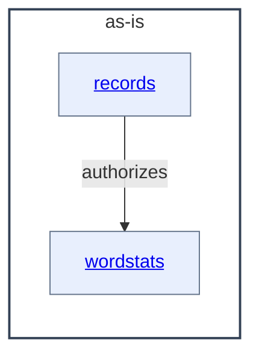

# as-is - as-is

## Purpose

Durable architecture context for the wordstats seed project: a tiny word-count library and CLI with deterministic validation, mock governance records, and fixture data. This record maps the project's immediate components; it does not replace the records owned by the areas it maps.

## Components

| Component | Purpose |
| --- | --- |
| [`wordstats`](src/wordstats/as-is.md#design) | Word-count library and `count` CLI producing sorted JSON frequencies. |
| [`records`](records/as-is.md#design) | Mock project governance records: backlog proposals and per-area ownership records. |

## Design

The project is a tiny Python utility (word counting plus a CLI) with deterministic validation, a mock governance-record area, and fixture data; only areas with their own `as-is.md` are components here.

**Lineage**: **as-is**

### Structural container

- `wordstats` owns the word-count logic and CLI surface; `tests/` covers the library and `checks/validate.sh` provides deterministic compile, unit, and CLI smoke validation using `sample-data/words.txt`.
- `records/` holds proposals and per-area ownership records; the ownership map directs consumers to stop for direction when an owner or change scope cannot be resolved from the records.
- `docs/design-notes.md` records human-facing design decisions before bounded changes that alter user-visible behavior.
- `.pi/` and `.as-is/` are host-projected runtime artifacts, not canonical components.

## Relationships

- The `records` owner records state the change scope for wordstats source areas; they do not transfer edit authority across areas.
- Validation is root-owned: `checks/validate.sh` validates wordstats behavior end to end and is not owned by either child component.

## Links

- [`checks/validate.sh`](checks/validate.sh) — deterministic validation entry point (compile, unit tests, CLI smoke check).
- [`records/ownership-map.md`](records/ownership-map.md) — parent-level normative context the child record does not restate: how change scope is resolved per area.
- [`docs/design-notes.md`](docs/design-notes.md) — where human-facing design decisions are recorded before bounded behavior changes.
