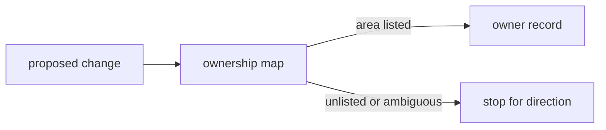

# records - as-is

## Purpose

Hold the project's mock governance records: backlog proposals and per-area ownership records that support component and scope resolution.

## Design

Governance records live in this directory; each record states its own authority limits, and no record here authorizes changes by itself.

**Lineage**: [as-is](../as-is.md#design) / **records**

### Ownership resolution

- `backlog.md` holds proposals only; selection and completion are governed by the project's planning procedure, not by this file.
- `ownership-map.md` maps areas to owner records and directs consumers to stop for direction when an owner or scope cannot be resolved.
- Owner records under `owners/` state area contracts and change scope; `owners/unassigned.md` records unowned areas without authorizing changes.

## Relationships

- Owner records describe change scopes for `src/wordstats/` and project docs; they do not authorize edits beyond the mapped scope.
- This component records governance; it implements no runtime behavior.

## Links

- [`ownership-map.md`](ownership-map.md) — the area-to-owner mapping and change-scope rules this component maintains.
- [`backlog.md`](backlog.md) — the proposal index this component maintains; planning input only, not task authority.
