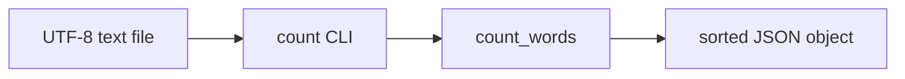

# wordstats - as-is

## Purpose

Provide word-count logic and the `count` CLI for the wordstats project: count lowercase words in UTF-8 text and print the mapping as JSON with sorted keys.

## Design

`src/wordstats/` contains the `count_words` library function and the `wordstats` CLI entry point (`python3 -m wordstats.cli`); unit tests under `tests/` and the smoke-check fixture contract are part of this component's validation context.

**Lineage**: [as-is](../../as-is.md#design) / **wordstats**

### Count pipeline

- Public contract: lowercase tokens, punctuation stripped from token edges, punctuation-only tokens ignored, counts returned as a mapping.
- CLI contract: `wordstats count <path>` prints a JSON object with 2-space indent and alphabetically sorted keys.

## Relationships

- The parent root component owns the deterministic validation path: `checks/validate.sh` compiles, unit-tests, and smoke-checks this component's CLI against `checks/expected-count.json` using `sample-data/words.txt`.
- The `records` component records this component's ownership and change scope; it does not implement wordstats behavior.

## Links

- [`records/owners/core-utility.md`](../../records/owners/core-utility.md) — owner record stating the public word-count and CLI output contract for this component.
- [`checks/expected-count.json`](../../checks/expected-count.json) — exact expected CLI output used by the smoke check; the concrete form of the output contract.
