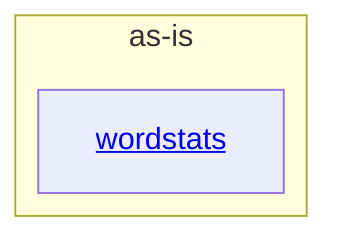

# as-is - as-is

## Purpose

Own the wordstats project's top-level composition map: the durable architecture
context for the project and navigation to its documented components. This record
does not replace the authority of the component records it maps or of the mock
project records under `records/`.

## Components

| Component | Purpose |
| --- | --- |
| [wordstats](src/wordstats/as-is.md#design) | Word-count library and `count` CLI producing sorted JSON word frequencies. |

## Design

The project is a single small utility: a Python word-count library with a thin
command-line interface, validated by focused unit tests and a deterministic
smoke check (`checks/validate.sh`).

**Lineage**: **as-is**

### Structural container

The project documents one component. `records/ownership-map.md` and the owner
records under `records/owners/` govern change scope for project areas;
`docs/design-notes.md` records design decisions before bounded changes. Fixture
input (`sample-data/`), documentation, and project records are project
artifacts, not components.
