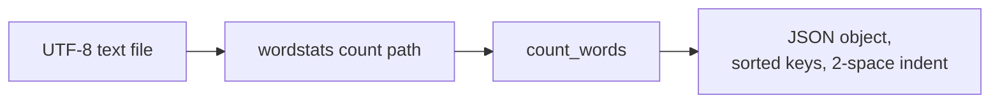

# wordstats - as-is

## Purpose

Provide word-count utilities for the wordstats project: a Python library that
maps lowercased words to occurrence counts, and the `wordstats count` CLI that
reads a UTF-8 text file and prints those counts as JSON.

## Design

A small library (`src/wordstats/counter.py`) owns tokenization and counting; a
thin CLI (`src/wordstats/cli.py`) owns file input and JSON output.

**Lineage**: [as-is](../../as-is.md#design) / **wordstats**

### Count flow

Stable composition and contract facts:

- Tokens are lowercased; punctuation is stripped from token edges; punctuation-only tokens are ignored; counts are returned as a mapping (`count_words`).
- CLI output is JSON with alphabetically sorted keys and 2-space indent, printed to stdout; the command is `wordstats count <path>`.
- Unit tests live in `tests/`; `checks/validate.sh` runs the compile check, unit tests, and a CLI smoke check against `checks/expected-count.json`.
- The output format is intentionally stable until the CLI output contract is revisited (existing backlog proposal).

## Relationships

- Child of the project root record [`as-is`](../../as-is.md#design).
- Consumes UTF-8 text files given as the CLI `path` argument; the smoke check feeds `sample-data/words.txt`.

## Links

- [`records/owners/core-utility.md`](../../records/owners/core-utility.md) — normative public contract for the word-count logic and CLI surface; ownership and change scope for this component.
