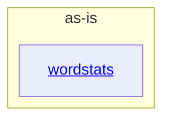

# as-is - as-is

## Purpose

Durable architecture context for the `wordstats` benchmark seed project: a tiny Python word-count library and CLI with deterministic validation. This record orients any agent working in the repository and maps its components.

## Components

| Component | Purpose |
| --- | --- |
| [`wordstats`](src/wordstats/as-is.md#design) | Word-count library and `count` CLI reporting JSON frequencies with sorted keys. |

## Design

The project is a single small utility: `src/wordstats` holds the library and CLI, `tests/` and `checks/validate.sh` verify it, and project-facing records live under `docs/` and `records/`.

**Lineage**: **as-is**

### Structural container

- `checks/validate.sh` is the deterministic validation entry point (compile check, unit tests, CLI smoke check against `checks/expected-count.json`); it exits nonzero on the first failed check.
- `records/ownership-map.md` maps change areas to owner records; an area without an owner record stops for direction rather than guessing.
- The seed ships no other agent-workflow configuration; setup records live at `as-is.md`, `AGENTS.md`, and the child record.

## Links

- User-facing project documentation → `README.md` — the entry point users consult; its `## Installation` section describes how to obtain and run the tool.
- Deterministic validation → `checks/validate.sh` — the required check before reporting any change complete.