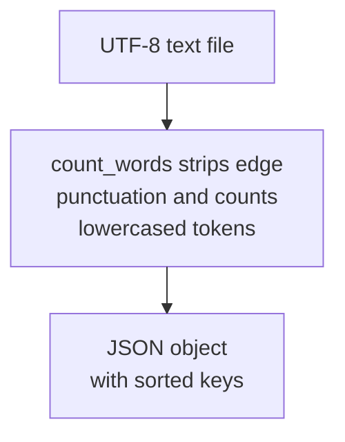

# wordstats - as-is

## Purpose

Owns the word-count responsibility of the project: a small pure-Python library (`counter.py`) and its command-line surface (`cli.py`) that count word frequencies in a UTF-8 text file.

## Design

`count_words(text)` returns a mapping of lowercased words to counts, stripping punctuation from token edges and ignoring punctuation-only tokens; `cli.py` exposes `wordstats count <path>` and prints the mapping as JSON with sorted keys and 2-space indent.

**Lineage**: [as-is](../../as-is.md#design) / **wordstats**

### Count flow

- The public contract is the mapping behavior above; the CLI adds argument parsing and JSON formatting but no counting logic.
- Change scope for this component is declared by `records/owners/core-utility.md`.