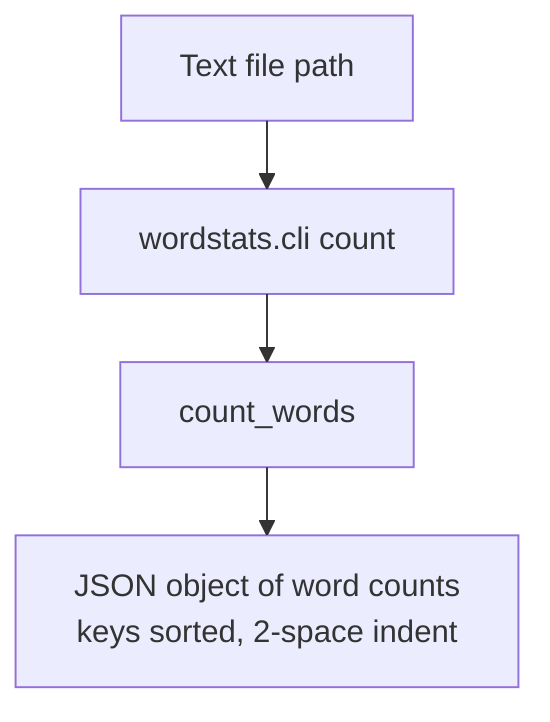

# wordstats - as-is

## Purpose

wordstats is a tiny word-count utility: a Python library (`count_words`) and a `count` CLI that report word frequencies for a UTF-8 text file as a JSON object with sorted keys. In this seed it exists only as benchmark fixture material and is validated by a deterministic check script.

## Design

The project root is a single component: one code area (`src/wordstats`), focused unit tests, and one deterministic validation surface; `records/ownership-map.md` is the local ownership record and `README.md` is the user-facing entry point.

**Lineage**: **wordstats**

### Count command outcome

- The CLI reads the file, delegates counting to `wordstats.counter.count_words`, and prints JSON to stdout; behavior is pinned by `checks/expected-count.json`.
- There are no approved child components; any finer decomposition is deferred to human architectural review (see `docs/as-is-setup-plan.md`).