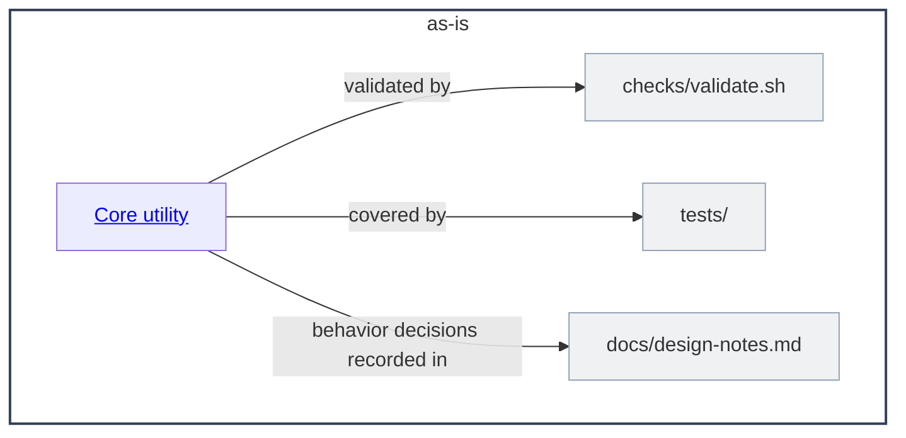

# as-is - as-is

## Purpose

Own the top-level map of the wordstats benchmark seed project: a tiny word-count library and CLI with deterministic validation. This record is durable shared context for human readers and agents; it does not replace the records owned by the areas it maps.

## Components

| Component | Purpose |
| --- | --- |
| [Core utility](src/wordstats/as-is.md#design) | Own the word-count logic, rare-word filtering, and the `wordstats count` CLI surface. |

`tests/`, `checks/`, `docs/`, `records/`, and `sample-data/` remain root artifacts without component records; ownership of individual root artifacts is recorded in `records/ownership-map.md`.

## Design

**Lineage**: **as-is**

The project is a single user-facing utility composed of one documented component. The root record connects the project to the core utility component; the deterministic validation script (`checks/validate.sh`) is the acceptance gate for behavior changes.

### Project component map

## Links

- [`records/ownership-map.md`](records/ownership-map.md) — mock ownership records supporting component/scope resolution.
- [`docs/design-notes.md`](docs/design-notes.md) — recorded user-visible behavior decisions.
- [`CHANGELOG.md`](CHANGELOG.md) — completed-change summaries.