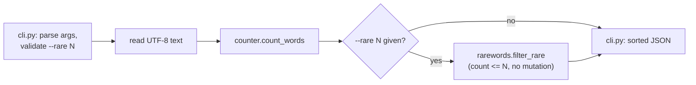

# core-utility - as-is

## Purpose

Own the word-count logic, rare-word filtering, and the `wordstats count` CLI surface of the wordstats project. The public contract is: lowercase tokens, punctuation stripped from token edges, punctuation-only tokens ignored, counts returned as a mapping; CLI output is JSON with sorted keys and 2-space indent; the optional `--rare N` flag keeps only words whose count is at most N, with N a positive integer.

## Design

**Lineage**: [as-is](../../as-is.md#design) / **core-utility**

The component separates pure counting and filtering logic from CLI presentation. `counter.py` counts words; `rarewords.py` filters an existing count mapping (pure function, no I/O); `cli.py` parses arguments, validates option values, wires the helpers, and prints sorted JSON. Filtering never mutates the mapping it is given, and the no-flag CLI output is unchanged.

### Count pipeline

## Links

- [`records/owners/core-utility.md`](../../records/owners/core-utility.md) — mock owner record for this component's files.
- [`../../docs/design-notes.md`](../../docs/design-notes.md) — user-visible behavior decisions, including the `--rare N` option.