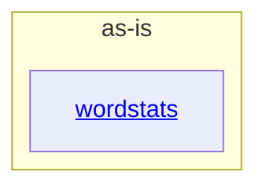

# as-is - as-is

## Purpose

Map the wordstats benchmark seed project's components and provide the durable entry point for its architecture records. Readers use this record to orient in the project's boundaries before reading any component detail; it does not replace the records of the components it maps.

## Components

| Component | Purpose |
| --- | --- |
| [`wordstats`](src/wordstats/as-is.md#design) | Word-count library and `count` CLI that turn a text file into sorted JSON word frequencies. |

## Design

The project is a tiny deterministic word-count utility: one component owns the library and CLI, one deterministic validation script gates every change, and the remaining files are records and fixtures.

**Lineage**: **as-is**

### Component container

- The `wordstats` component owns the counting logic and CLI surface under `src/wordstats/`; its public contract lives in `records/owners/core-utility.md`.
- `checks/validate.sh` is the project-level deterministic gate: a compile check, then the unit tests, then a CLI smoke check against `checks/expected-count.json`, with no network access and a nonzero exit on the first failed check. It validates the project; it is not a component.
- `docs/design-notes.md` records human-facing design decisions; `records/ownership-map.md` and `records/owners/` record the ownership facts used to resolve change scope.

## Relationships

- The `wordstats` component implements the public contract recorded in `records/owners/core-utility.md` and is validated by `checks/validate.sh`.
- `README.md` and `docs/` are project-level artifacts owned through `records/owners/design-notes.md`, not components.

## Links

- [`records/ownership-map.md`](records/ownership-map.md) — owner records used to resolve change scope for project areas.
- [`checks/validate.sh`](checks/validate.sh) — the deterministic validation gate every change must pass.
