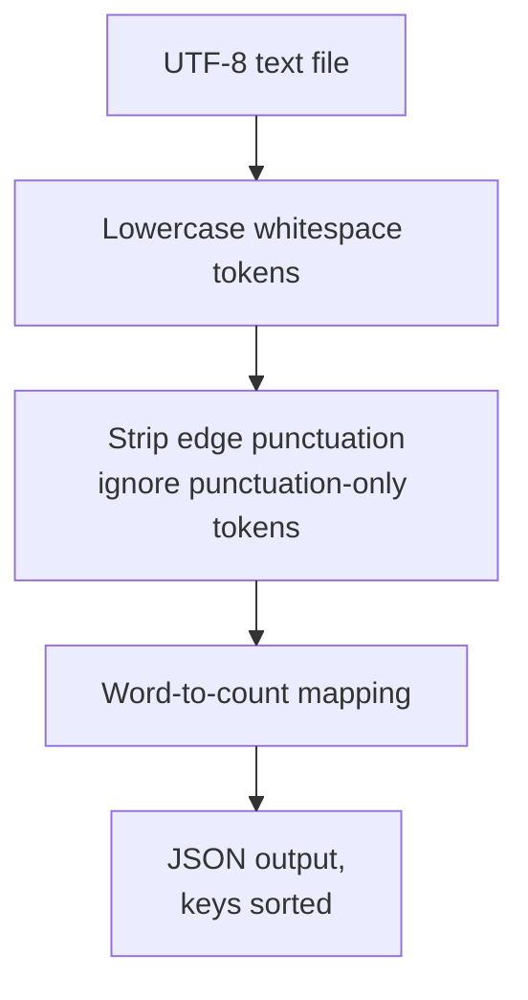

# wordstats - as-is

## Purpose

Provide the word-count library and `count` CLI: read a UTF-8 text file, count lowercased words, and print the frequencies as JSON with sorted keys.

## Design

One Python package provides the counting logic (`counter.py`) and the CLI surface (`cli.py`); the focused unit tests live in `tests/` and `sample-data/words.txt` is the fixed smoke-check input.

**Lineage**: [as-is](../../as-is.md#design) / **wordstats**

### Count pipeline

The public contract is: lowercase tokens, punctuation stripped from token edges, punctuation-only tokens ignored, counts returned as a mapping. The CLI prints the mapping as JSON with 2-space indent and sorted keys and exits 0 on success.

## Relationships

- `checks/validate.sh` validates this component through the compile check, unit tests, and CLI smoke check; the smoke check compares CLI output byte-for-byte against `checks/expected-count.json`.
- No runtime dependency beyond the Python standard library.

## Links

- [`records/owners/core-utility.md`](../../records/owners/core-utility.md) — owner record holding the public contract for this component.
