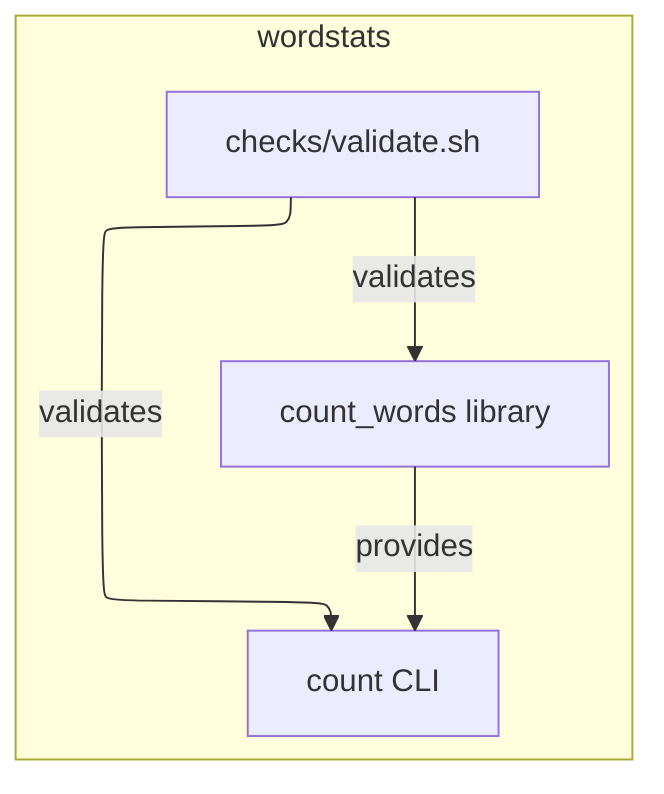

# wordstats - as-is

## Purpose

Provide a tiny word-count library and `count` CLI that report word frequencies as sorted JSON, with a deterministic validation gate that every change must pass. The project exists as a fixed benchmark seed fixture, not as a live or promoted artifact.

## Design

This is a single-component project: the word-count library and CLI in `src/wordstats/` form one responsibility, and `checks/validate.sh` is the deterministic gate for changes to it. The project intentionally ships no agent-workflow configuration; adopters perform their own setup and record it outside this record.

**Lineage**: **wordstats**

### Component context

- `src/wordstats/counter.py` owns counting semantics: lowercase tokens, punctuation stripped from token edges, punctuation-only tokens ignored, counts returned as a mapping.
- `src/wordstats/cli.py` owns the `count` surface: JSON output with sorted keys and 2-space indent.
- `checks/validate.sh` is the deterministic validation entry point: compile check, unit tests, and a CLI smoke check against `checks/expected-count.json`; no network access, exits nonzero on the first failed check.
- `docs/validation.md` explains the validation flow for new readers.

## Relationships

- Ownership records under `records/` map source and docs artifacts to owner records; `records/ownership-map.md` resolves change scope for consumers.
- `docs/design-notes.md` records design decisions and the bounded changes they authorize.

## Links

- [`checks/validate.sh`](checks/validate.sh) — the deterministic validation entry point and its contract.
- [`docs/validation.md`](docs/validation.md) — reader-facing explanation of the validation flow.
- [`docs/design-notes.md`](docs/design-notes.md) — recorded design decisions and their bounded changes.
- [`records/ownership-map.md`](records/ownership-map.md) — ownership records used to resolve change scope.