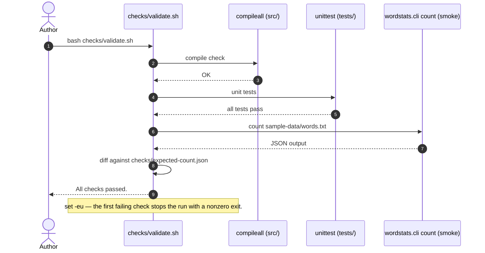

# Deterministic validation

This page explains how the project's deterministic validation works for a new reader. One command, `checks/validate.sh`, compiles the source, runs the unit tests, and smoke-tests the CLI. It needs no network access and exits nonzero on the first failed check, so a broken change is caught the same way on every machine.

## Running the checks

```sh
bash checks/validate.sh
```

## What the script runs

The script starts with `set -eu`, so it stops at the first check that exits nonzero and never runs a later check after an earlier one fails. The three checks run in a fixed order:

1. Compile check — `python3 -m compileall -q src` byte-compiles everything under `src/` and fails on any syntax error.
2. Unit tests — `PYTHONPATH=src python3 -m unittest discover -s tests -v` runs the focused tests in `tests/` against the library.
3. CLI smoke check — `PYTHONPATH=src python3 -m wordstats.cli count sample-data/words.txt` runs the real `count` CLI on the fixed sample input and `diff`s its JSON output against `checks/expected-count.json`; any difference fails the check.

## Validation flow



## Reading the result

A passing run prints `compile: OK`, `unit tests: OK`, `cli smoke check: OK`, and finally `All checks passed.`, and exits with status 0. If any check fails, the script stops there, prints that check's error output, and exits nonzero; the failing check's own message is the first thing to read.