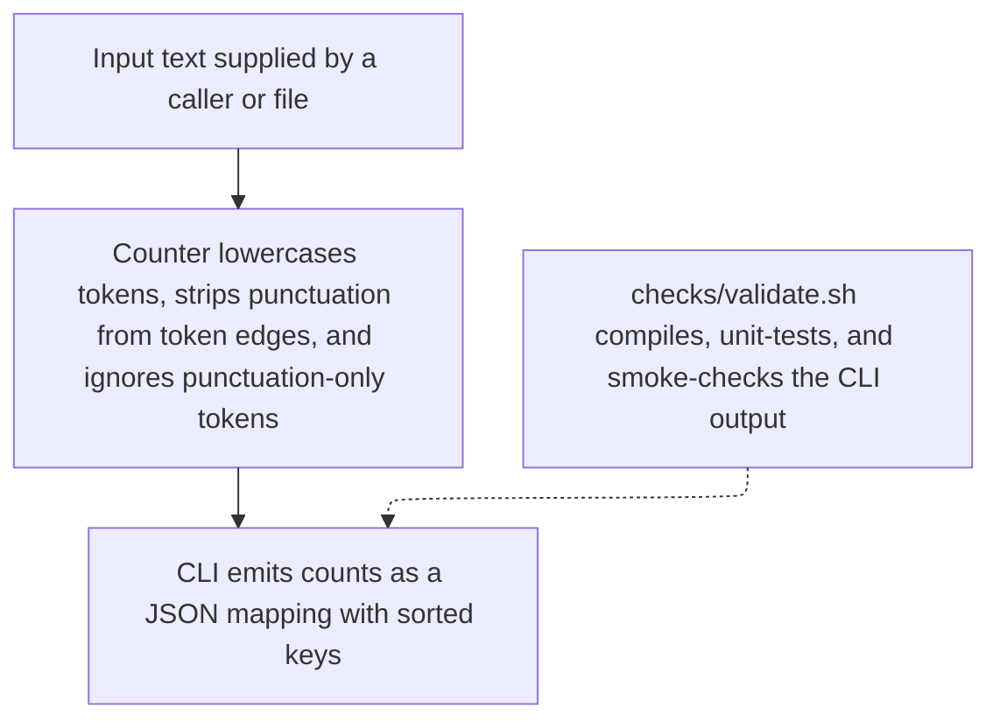

# wordstats - as-is

## Purpose

`wordstats` is a small word-count utility: a Python library plus a `count` CLI that reports word frequencies as sorted JSON. This record is the canonical architecture context for the project as a single bounded component.

## Design

The utility has two cooperating parts behind one public contract: counting in `src/wordstats/counter.py` and the CLI surface in `src/wordstats/cli.py`. The contract is: lowercase tokens, punctuation stripped from token edges, punctuation-only tokens ignored, counts returned as a mapping, and CLI output as JSON with sorted keys. Validation is the deterministic `checks/validate.sh` (compile check, unit tests, CLI smoke check against `checks/expected-count.json`); it must pass with no network access before any handoff.

**Lineage**: **wordstats**

### Count request flow

The diagram is a supplementary smallest-supported view of the ordinary count path; failure and recovery behavior is not shown because validation treats any check failure as a hard stop.

## Relationships

| Relationship | Direction | Fact |
| --- | --- | --- |
| Ownership map | reads | [`records/ownership-map.md`](records/ownership-map.md) is the authority for which owner record governs a change and its scope; unmapped areas require stopping for direction. |
| Owner records | delegates-to | `records/owners/core-utility.md` documents the counting/CLI contract; `records/owners/design-notes.md` owns human-facing docs. |
| Sample data | uses | `sample-data/words.txt` is the fixed smoke-check input; its area currently has no owner record (see `records/owners/unassigned.md`). |

## Links

- `records/ownership-map.md` → [records/ownership-map.md](records/ownership-map.md) — ownership and change-scope authority; consult before touching any area.
- `checks/validate.sh` → [checks/validate.sh](checks/validate.sh) — the deterministic validation entry point and its acceptance bar.
- `README.md` → [README.md](README.md) — reader-facing project orientation and check instructions.