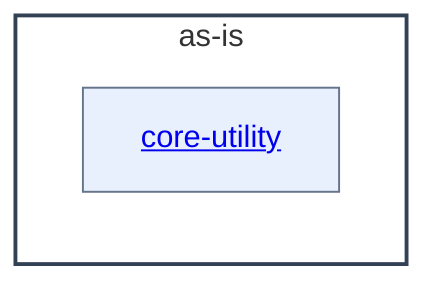

# as-is - as-is

## Purpose

Durable architecture context for the wordstats benchmark seed project: a tiny word-count library and `count` CLI with fixed sample data and deterministic checks. This record orients readers and agents to what exists, where ownership and contracts are recorded, and how the pieces relate; it does not replace the records it links.

## Components

| Component | Purpose |
| --- | --- |
| [`core-utility`](src/wordstats/as-is.md#design) | Word-count logic and the `wordstats count` CLI surface under `src/wordstats/`. |

## Design

The project contains one code component, `core-utility`. The ownership map classifies `docs/design-notes.md` and `README.md` as `artifact` scope; `records/`, `checks/`, `sample-data/`, and the rest of `docs/` are non-component project material rather than components.

**Lineage**: **as-is**

### Structural container

- The public contract of `core-utility` (lowercase tokens, punctuation stripped from token edges, punctuation-only tokens ignored, CLI JSON output with sorted keys) is owned by the project's owner record `records/owners/core-utility.md`.
- `checks/validate.sh` is the deterministic validation entry point (compile check, unit tests, CLI smoke check against `checks/expected-count.json`) and defines how behavior changes are verified.

## Relationships

- `records/ownership-map.md` resolves the owner record and change scope for areas inside this root; unknown or ambiguous ownership is a stop-for-direction, not a guess.
- `checks/validate.sh` is the deterministic gate that changes to `core-utility` pass before handoff; it exercises the component through its CLI surface against fixed input.
- `docs/design-notes.md` records the design decision behind the user-visible `count` output format.

## Links

- Ownership map → `records/ownership-map.md` — resolves owner and change scope before bounded changes; unresolvable ownership requires stopping for direction.
- Design notes → `docs/design-notes.md` — user-visible changes require a recorded note (decision, options considered, bounded change authorized) per the project's owner convention.