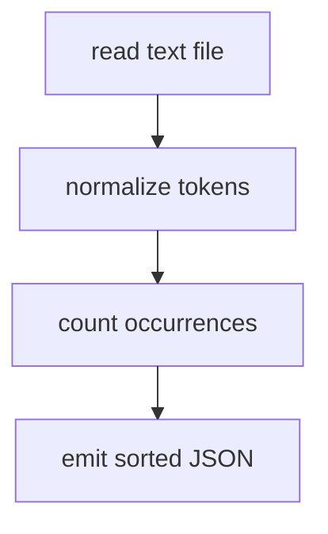

# core-utility - as-is

## Purpose

Owns the word-count behavior of the seed project: the `count_words` mapping logic and the `wordstats count` CLI that prints word frequencies as sorted, 2-space-indented JSON.

## Design

`core-utility` spans the mapping logic and the CLI adapter over it; both share the single public contract recorded by the project's owner record, and the CLI adds no counting behavior of its own.

**Lineage**: [as-is](../../as-is.md#design) / **core-utility**

### Count command flow

- Tokens are lowercased; punctuation is stripped from token edges; punctuation-only tokens are ignored; counts are returned as a mapping.
- The CLI prints the mapping as JSON with sorted keys and 2-space indent. No package is published; the surface is exercised from a repository checkout via `PYTHONPATH=src python3 -m wordstats.cli count <path>`.
- `checks/validate.sh` verifies the component through compile check, unit tests, and a CLI smoke check against `checks/expected-count.json`.

## Links

- Project owner record → `records/owners/core-utility.md` — the normative public contract (normalization, counting, CLI output) that changes to this component must preserve.