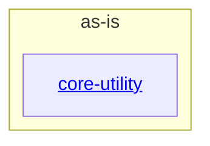

# as-is - as-is

## Purpose

Own the repository-wide architecture map of the wordstats benchmark fixture: the word-count library and CLI, the supporting mock ownership records, and the conventions agents must follow when changing them. This record is durable shared context for human readers and agents; it does not replace the records owned by the components it maps.

## Components

| Component | Purpose |
| --- | --- |
| [`core-utility`](src/wordstats/as-is.md#design) | Own the word-count library and the `wordstats count` CLI surface. |

## Design

The project is a tiny fixture deliberately kept in one documented component; the root record orients readers and routes ownership and design-decision questions to the seed's mock records.

**Lineage**: **as-is**

### Structural container

- `src/wordstats/` is the only documented component boundary; `tests/`, `checks/`, and `sample-data/` are supporting fixtures without independent ownership records.
- Change scope is resolved through the seed's ownership map before edits; unmapped areas require stop-for-direction.
- User-visible behavior changes are authorized by a design note recorded before the change.

## Relationships

- The parent project delegates no runtime authority; the component record and the seed owner records (`records/owners/`) carry the normative contracts.
- The benchmark harness (`checks/validate.sh`) validates the component's public behavior deterministically after every change.

## Links

- Change-scope resolution: `records/ownership-map.md` — the seed's owner-to-scope map; authoritative for deciding which record owns a change.
- Design-decision convention: `docs/design-notes.md` — where design notes are recorded before user-visible bounded changes.