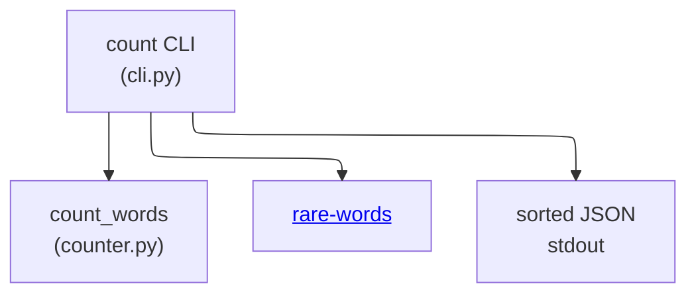

# core-utility - as-is

## Purpose

Own the word-count logic and CLI surface of the wordstats fixture (`src/wordstats/`): lowercased token counting with edge punctuation stripped, exposed as a `wordstats count` CLI that prints JSON with sorted keys and 2-space indent, including the optional `--rare N` rare-word filter.

## Components

| Component | Purpose |
| --- | --- |
| [`rare-words`](rare-words/as-is.md#design) | Own the rare-words filtering helper module `rarewords.py`. |

## Design

The component is a single small library module plus its command-line entry point; both the counting contract and the CLI output contract are fixed public behavior validated by the deterministic checks.

**Lineage**: [as-is](../../as-is.md#design) / **core-utility**

### Count pipeline

- `count_words` lowercases tokens, strips punctuation from token edges, and ignores punctuation-only tokens; counts are returned as a mapping.
- The CLI reads a UTF-8 text file and prints `json.dumps(counts, indent=2, sort_keys=True)`.
- The public contract and ownership are recorded in the seed owner record linked below; the deterministic smoke check pins the CLI output format.

## Relationships

- The seed owner record `records/owners/core-utility.md` carries the normative public contract for this boundary; where this record and that owner record disagree, stop for direction rather than silently reconciling.
- `tests/` and `checks/` validate this component's behavior but are fixture areas, not separately owned components.

## Links

- Owner record (public contract): `records/owners/core-utility.md` — normative counting and CLI output contract that changes to this component must preserve.