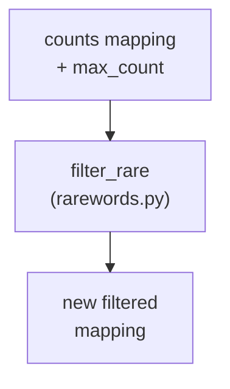

# rare-words - as-is

## Purpose

Own the rare-words filtering helper module `src/wordstats/rarewords.py`: given a word-to-count mapping and a positive integer threshold, return a new mapping containing only entries whose count is at most the threshold.

## Design

The component is a single pure helper function with a pinned contract, consumed by the parent CLI; it performs no I/O and owns no state.

**Lineage**: [as-is](../../../as-is.md#design) / [core-utility](../as-is.md#design) / **rare-words**

### Rare-word filtering flow

- Pinned contract: `filter_rare(counts: Mapping[str, int], max_count: int) -> dict[str, int]` returns a new mapping with entries whose count is <= `max_count`; it does not mutate the input; an empty input mapping yields an empty mapping.
- CLI-side input validation (positive-integer requirement, exit 2) is the parent's responsibility in `cli.py`; this module validates nothing about where its arguments came from.
- This record directory (`src/wordstats/rare-words/`) is the component's record and task-record location; it contains no Python code and is not a package, so it cannot shadow the `rarewords` module.

## Relationships

- Parent: `core-utility` consumes `filter_rare` from the `count` CLI in `src/wordstats/cli.py`.
- Boundary: this component owns only `src/wordstats/rarewords.py`; tests for the helper and the CLI option are authored by the parent under the `tests/` core-utility test scope.