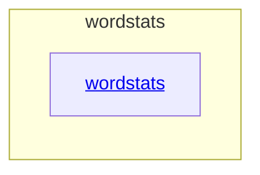

# wordstats - as-is

## Purpose

Own the wordstats project: a tiny word-count library and `count` CLI that reports word frequencies as sorted JSON. This root record maps the project to its immediate component and provides top-level orientation; it does not replace the component record's own authority.

## Components

| Component | Purpose |
| --- | --- |
| [wordstats](src/wordstats/as-is.md#design) | Word-count library (`count_words`) and the `wordstats count` CLI surface. |

## Design

The project is a single Python package with a focused CLI entry point, validated by deterministic checks.

**Lineage**: **wordstats**

Unit tests cover the counting rules; `checks/validate.sh` runs a compile check, the unit tests, and a CLI smoke check against a fixed expected output.

### Project component map

## Relationships

| Relation | Direction | Fact |
| --- | --- | --- |
| validation | `checks/validate.sh` validates | The root validation script compiles, unit-tests, and smoke-checks the wordstats component. |
| ownership | `records/ownership-map.md` resolves | Component and artifact ownership records live under `records/`; consumers stop for direction when an owner cannot be resolved. |
| history | `CHANGELOG.md` records | Durable change history for the project is summarized here. |