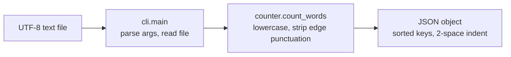

# wordstats - as-is

## Purpose

Provide the word-count logic and its command-line surface: lowercase tokens with punctuation stripped from token edges, punctuation-only tokens ignored, counts returned as a mapping; `wordstats count <path>` prints that mapping as JSON with sorted keys and 2-space indent.

## Design

The package separates counting policy from presentation: `counter.count_words` owns tokenization and counting; `cli.main` owns argument parsing, file reading, and JSON emission.

**Lineage**: [wordstats](../../as-is.md#design) / **wordstats**

| Part | Responsibility |
| --- | --- |
| `counter.py` | Pure tokenization and counting (`count_words`); no I/O. |
| `rarewords.py` | Pure rare-word filtering (`filter_rare`); keeps words with count <= limit; no I/O. |
| `cli.py` | `count` subcommand argument parsing, file reading, JSON output, `--rare N` option-level filtering. |

### Count pipeline

## Relationships

| Relation | Direction | Fact |
| --- | --- | --- |
| parent | wordstats (root) | The root record `../../as-is.md` maps this component; the parent does not own this record's files. |
| ownership | `records/owners/core-utility.md` | The core-utility owner record holds this component's public contract; the ownership map resolves scope. |
| validation | `checks/validate.sh` | Compile check, unit tests, and CLI smoke check validate this component's behavior. |