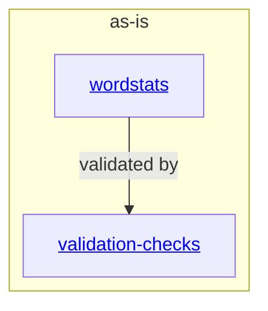

# as-is - as-is

## Purpose

Durable architecture context for the wordstats project: a tiny Python word-count library and `count` CLI with a deterministic, offline validation entry point. This record orients readers and routes them to the component records.

## Components

| Component | Purpose |
| --- | --- |
| [`wordstats`](src/wordstats/as-is.md#design) | Word-count logic and the `wordstats count` CLI printing JSON with sorted keys. |
| [`validation-checks`](checks/as-is.md#design) | Deterministic fail-fast validation via `checks/validate.sh`: compile check, unit tests, CLI smoke check. |

## Design

The project is a single-purpose utility: `src/wordstats` owns the counting logic and command-line surface, and `checks/` owns the deterministic validation entry point that authors and agents run to verify every change.

**Lineage**: **as-is**

### Structural container

- The counting contract: lowercased tokens, punctuation stripped from token edges, punctuation-only tokens ignored, counts returned as a mapping; CLI output is JSON with sorted keys.
- The validation contract: `bash checks/validate.sh` is offline and exits nonzero on the first failed check.
- `docs/design-notes.md` and `records/ownership-map.md` are human-facing project artifacts, not components.

## Relationships

- `records/ownership-map.md` maps source and documentation areas to owner records; it scopes change authority for those artifacts.
- Reader-facing explanation of the validation flow lives in `docs/validation.md`.

## Links

- Project orientation and check usage → `README.md` — describes project contents and how to run the checks.
- Component ownership and change scope → `records/ownership-map.md` — resolves owner records and change scopes for source and documentation areas.