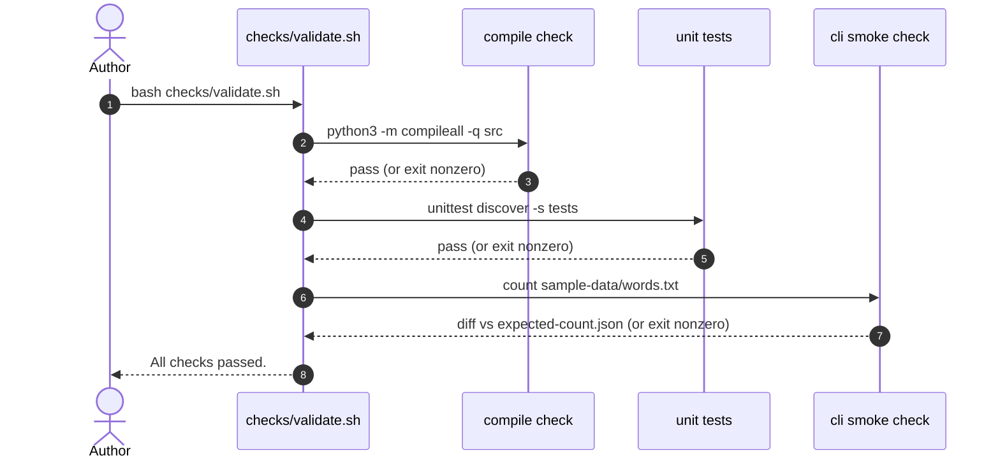

# validation-checks - as-is

## Purpose

Provide deterministic, offline validation for the whole project through the single entry point `checks/validate.sh`, so authors and agents verify every change the same way.

## Design

`checks/validate.sh` runs three checks in a fixed order and exits nonzero on the first failure: byte-compile of `src`, the unit tests in `tests/`, and a CLI smoke check diffing `wordstats count` output against `checks/expected-count.json`.

**Lineage**: [as-is](../as-is.md#design) / **validation-checks**

### Validation flow

- Fail-fast: the script runs under `set -eu`, stops at the first failed check, and performs no network access and no retry.
- The smoke check is pinned: fixed input `sample-data/words.txt` and expected output `checks/expected-count.json`.
- Determinism depends on those fixtures; changing them is a validation-expectation change, not a code change.
- A new-reader walkthrough of this flow lives in `docs/validation.md`.

## Relationships

- Validates the [`wordstats`](../src/wordstats/as-is.md#design) library and CLI.