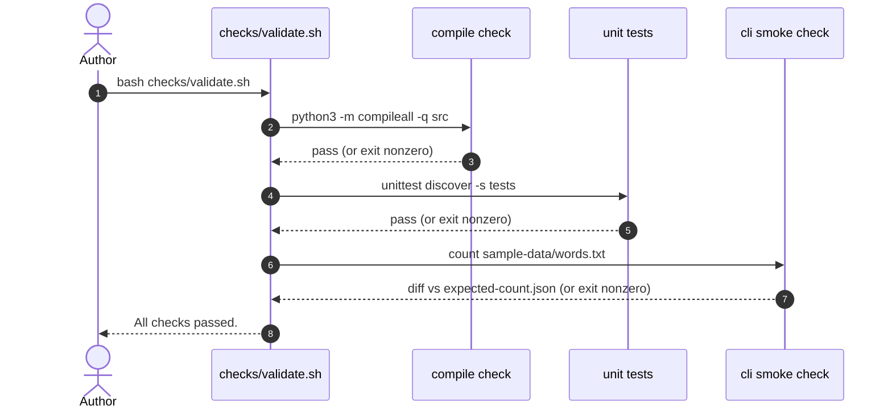

# Deterministic validation

This document explains how the project's deterministic validation works for a new reader. One command validates every change:

```sh
bash checks/validate.sh
```

## What the script checks

`checks/validate.sh` runs three checks in a fixed order. It uses `set -eu`, so it stops at the first failure and exits nonzero; when everything passes it prints `All checks passed.` and exits 0. No check touches the network.

| # | Check | Command | Verifies |
| --- | --- | --- | --- |
| 1 | Compile check | `python3 -m compileall -q src` | Every Python file under `src/` parses and byte-compiles. |
| 2 | Unit tests | `PYTHONPATH=src python3 -m unittest discover -s tests -v` | The counting contract: lowercasing, punctuation stripping, punctuation-only tokens, empty input. |
| 3 | CLI smoke check | `PYTHONPATH=src python3 -m wordstats.cli count sample-data/words.txt` | The `count` CLI produces exactly the JSON pinned in `checks/expected-count.json`. |

## Validation flow



## Determinism

The checks are deterministic because they depend only on the repository contents: the fixed input `sample-data/words.txt` and the pinned expectation `checks/expected-count.json`. Changing either fixture changes what "correct" means, so such a change is a validation-expectation change and must be made deliberately. A failed check is fixed by correcting the code or the expectation — never by editing the script to skip a check.

## Where this is recorded

The durable architecture context for the validation entry point is [`checks/as-is.md`](../checks/as-is.md); project decisions are recorded in `docs/design-notes.md`.