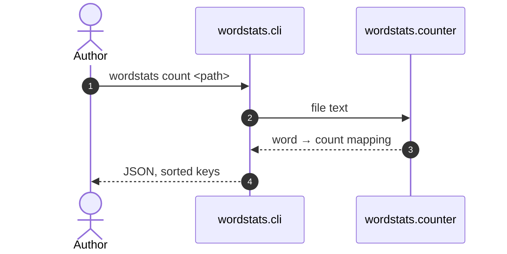

# wordstats - as-is

## Purpose

Provide the word-count logic and the `wordstats count` command-line interface: count words in a UTF-8 text file and print word frequencies as JSON with sorted keys.

## Design

`wordstats.counter` implements the counting contract; `wordstats.cli` exposes it as the `count` subcommand, which reads the input file and prints the result.

**Lineage**: [as-is](../../as-is.md#design) / **wordstats**

### Count request flow

- Counting contract: lowercased tokens, punctuation stripped from token edges, punctuation-only tokens ignored, counts returned as a mapping.
- CLI contract: JSON output with 2-space indent and alphabetically sorted keys; input is read as UTF-8.
- A missing or unreadable input file surfaces as an ordinary runtime error; no designed recovery path exists.

## Relationships

- Depends only on the Python standard library.
- Is verified by the [`validation-checks`](../../checks/as-is.md#design) compile check, unit tests, and CLI smoke check.