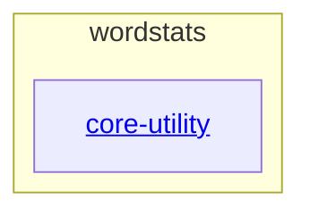

# wordstats - as-is

## Purpose

wordstats provides a deterministic word-count library and `count` CLI that report word frequencies as sorted JSON, and serves as the fixed seed fixture for the workflow benchmark. It is not a live or promoted artifact.

## Components

| Component | Purpose |
| --- | --- |
| [`core-utility`](src/wordstats/as-is.md#design) | Word-count logic and the `count` CLI surface. |

## Design

A small Python project whose root owns deterministic validation, fixed sample data, docs conventions, and mock ownership records around the single core-utility child component.

**Lineage**: **wordstats**

### Structural container

- Deterministic validation: `bash checks/validate.sh` runs the compile check, unit tests, and CLI smoke check in order, exits nonzero on the first failure, and needs no network access.
- The CLI smoke check pins `count` output against `checks/expected-count.json` using the fixed input `sample-data/words.txt`.
- Change ownership and scope are recorded in the ownership map; design decisions are recorded as notes in `docs/design-notes.md` before bounded behavior-changing work.

## Relationships

- `core-utility` is the only documented child component; validation, sample data, docs, and records are root-owned artifacts rather than components.
- The ownership map authorizes change scope; task mechanics follow the component task-record protocol.

## Links

- Deterministic validation entry point → `checks/validate.sh` — the authoritative runnable validation procedure.
- Validation guide → `docs/validation.md` — new-reader explanation of the validation flow.
- Ownership map → `records/ownership-map.md` — resolves area owners and change scopes.
- Design notes → `docs/design-notes.md` — durable design decisions and the bounded changes they authorize.