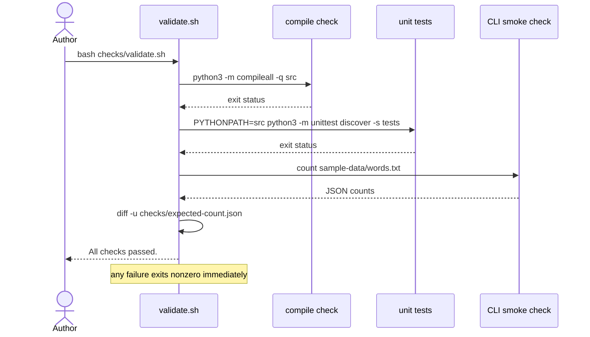

# Validation

This guide explains the project's deterministic validation for a new reader. Run it with:

```sh
bash checks/validate.sh
```

The script is deterministic and offline: it needs no network access, uses only fixed inputs, and gives the same result for the same tree. It runs three checks in order and stops at the first failure (`set -eu`), exiting nonzero so callers and automation can rely on a zero exit only when the whole tree is valid.

1. Compile check: `python3 -m compileall -q src` verifies that every source file compiles.
2. Unit tests: `PYTHONPATH=src python3 -m unittest discover -s tests -v` runs the library test suite.
3. CLI smoke check: the `count` CLI runs against the fixed input `sample-data/words.txt`, and its JSON output is diffed against the pinned expectation in `checks/expected-count.json`.

Each check prints an `OK` line as it passes; a full run ends with `All checks passed.`

### Validation flow



If a check fails, fix the failing check and rerun the script; do not bypass a failed check. If a change intentionally alters the `count` output contract, update `checks/expected-count.json` together with the change (see `records/owners/core-utility.md`).