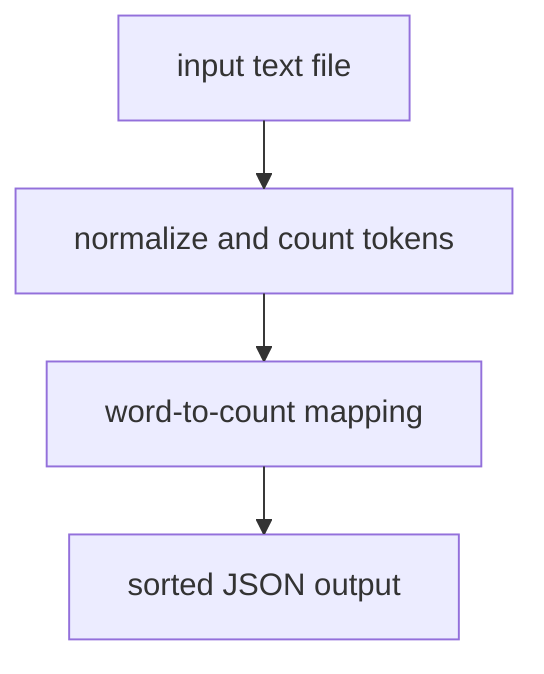

# core-utility - as-is

## Purpose

Provide the word-count logic and `count` CLI: lowercase tokens with edge punctuation stripped, punctuation-only tokens ignored, counts returned as a mapping, and CLI output printed as JSON with sorted keys.

## Design

A single-module library (`counter.py`) behind a thin argparse CLI (`cli.py`), with the public contract owned by the core-utility owner record.

**Lineage**: [wordstats](../../as-is.md#design) / **core-utility**

### Count flow

## Relationships

- Parent component: [wordstats](../../as-is.md#design); this record owns only `src/wordstats/`.
- The validation smoke check pins CLI output against `checks/expected-count.json`; changing the output contract requires updating that expectation and the owner record together.

## Links

- Owner record → `../../records/owners/core-utility.md` — public contract and change scope for the CLI surface.