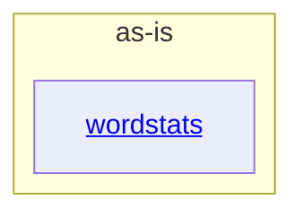

# as-is - as-is

## Purpose

Durable architecture context for the wordstats benchmark seed: a small word-count library and `count` CLI with deterministic validation and mock ownership records. This record orients readers and routes them to component records.

## Components

| Component | Purpose |
| --- | --- |
| [`wordstats`](src/wordstats/as-is.md#design) | Word-count library and `count` CLI owning the documented public output contract. |

## Design

The project root owns deterministic validation (`checks/validate.sh`), mock planning and ownership records (`records/`), design notes (`docs/design-notes.md`), and fixed sample input (`sample-data/`); component architecture context lives in the child record.

**Lineage**: **as-is**

### Project structure

## Relationships

- `wordstats` is the only area with its own component record; `checks/`, `records/`, `docs/`, `sample-data/`, and `tests/` remain artifacts or process metadata at the root and are not separate components.

## Links

- Ownership resolution rules → `records/ownership-map.md` — area-to-owner mapping with the stop-for-direction rule that governs any scope resolution.
- Design decision notes → `docs/design-notes.md` — human-facing design decisions that authorize bounded user-visible changes.
