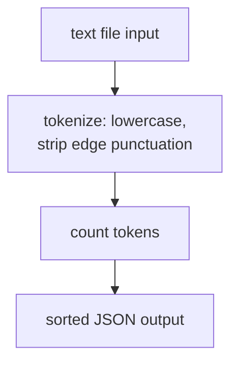

# wordstats - as-is

## Purpose

Word-count library and `count` CLI. Owns the public contract recorded in the core-utility owner record: lowercase tokens, punctuation stripped from token edges, punctuation-only tokens ignored, counts returned as a mapping, and JSON CLI output with sorted keys.

## Design

`count_words` performs tokenization and counting; the CLI wraps it with file input and JSON serialization and is the only human-facing surface.

**Lineage**: [as-is](../../as-is.md#design) / **wordstats**

### Count pipeline

## Relationships

- The deterministic smoke check in `checks/validate.sh` freezes the CLI output format against `checks/expected-count.json`.
- The core-utility owner record is the authority for the public contract; contract changes require a recorded design note before bounded changes.

## Links

- Core-utility owner record → `records/owners/core-utility.md` — normative public-contract statement that bounds any CLI or counting change.
