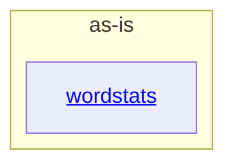

# as-is - as-is

## Purpose

Root architecture record for the wordstats benchmark seed project: a tiny mock Python project providing a word-count library and `count` CLI with deterministic validation. This record orients readers and routes them to component records; it holds no task, backlog, or runtime authority.

## Components

| Component | Purpose |
| --- | --- |
| [`wordstats`](src/wordstats/as-is.md#design) | Word-count library and `count` CLI producing sorted JSON output. |

## Design

The project is a single small utility: deterministic validation (`checks/validate.sh`) compiles the source, runs the unit tests, and smoke-checks the CLI against `checks/expected-count.json`.

**Lineage**: **as-is**

### Structural container

`wordstats` is the only documented immediate child component. Support areas (`checks/`, `tests/`, `sample-data/`, `docs/`, `records/`) are project artifacts rather than components; change authority for known areas is resolved through the ownership map, and unknown or ambiguous areas stop for direction rather than guess.

## Relationships

- Change authority: the ownership map resolves the owning record and change scope per area; it is the authority consulted before bounded changes.

## Links

- Project overview → `README.md` — project contents and how to run the deterministic checks.
- Ownership map → `records/ownership-map.md` — authority map used to resolve owners and change scopes before bounded changes.