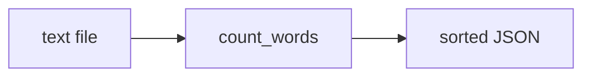

# wordstats - as-is

## Purpose

Provide word counting for UTF-8 text files and expose it through a `count` CLI. The public contract: lowercase tokens, punctuation stripped from token edges, punctuation-only tokens ignored, counts returned as a mapping; the CLI prints the counts as JSON with alphabetically sorted keys and 2-space indent.

## Design

The component pairs a pure counting function with a thin argparse CLI wrapper; output is a sorted JSON object.

**Lineage**: [as-is](../../as-is.md#design) / **wordstats**

### Count pipeline

## Relationships

- Consumer: `checks/validate.sh` smoke-checks the CLI output against `checks/expected-count.json` as part of deterministic validation.

## Links

- Owner record → `../../records/owners/core-utility.md` — records this component's public contract and component change scope.