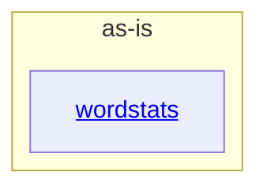

# as-is - as-is

## Purpose

Durable architecture context for the wordstats benchmark seed project: a tiny Python word-count library and `count` CLI with deterministic validation. This record is the navigation root and the authoritative map of the project's component boundaries.

## Components

| Component | Purpose |
| --- | --- |
| [`wordstats`](src/wordstats/as-is.md#design) | Word-count library and `count` CLI: normalizes text into per-word counts and emits them as sorted JSON with a total. |

## Design

The project is a single-command utility with one component boundary; every other directory is validation, fixture, ownership, or design-history context rather than a component.

**Lineage**: **as-is**

### Structural container

- The root boundary contains exactly one component, `wordstats`; the change scope of each area is authorized by `records/ownership-map.md`.
- `checks/validate.sh` (compile, unit tests, CLI smoke check against `checks/expected-count.json`) is the deterministic acceptance gate for any change.

## Links

- Ownership and change-scope authority → `records/ownership-map.md` — Resolves which owner record governs a change before any edit; unknown or ambiguous areas require stopping for direction.