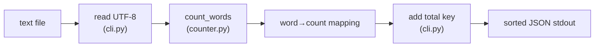

# wordstats - as-is

## Purpose

Provide word-frequency counting for text files: a small pure-Python library (`count_words`) and a `wordstats count <path>` CLI that prints per-word counts plus their total as sorted JSON.

## Design

`count_words(text)` returns a mapping of lowercased words to occurrence counts; punctuation is stripped from token edges and punctuation-only tokens are ignored. The CLI owns the output contract: `wordstats count <path>` reads a UTF-8 file and prints the counts as 2-space-indented JSON with alphabetically sorted keys, alongside a `total` key holding the sum of all per-word counts, per the decision recorded in `docs/design-notes.md`. Known limitation: if the input contains the literal word `total`, the sum overwrites its per-word count in the output.

**Lineage**: [as-is](../../as-is.md#design) / **wordstats**

### Count command flow

The word→count mapping is the library contract; the `total` key and JSON formatting are CLI-contract concerns and are deliberately not part of `count_words`.

## Relationships

| Related | Relationship |
| --- | --- |
| `checks/validate.sh` | Validates this component: compile, unit tests, and a CLI smoke check against `checks/expected-count.json`. |
| `records/owners/core-utility.md` | Owns this component's change scope and public contract. |

## Links

- Design decisions for the CLI output contract → `docs/design-notes.md` — Normative design-note record consulted before user-visible behavior changes.