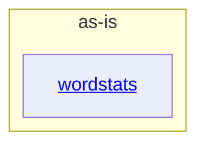

# as-is - as-is

## Purpose

Map the wordstats benchmark seed project: a tiny word-count library and CLI, with deterministic checks, mock ownership records, human-facing design notes, and sample data as supporting artifacts. This record is the top-level architecture context for the project.

## Components

| Component | Purpose |
| --- | --- |
| [`wordstats`](src/wordstats/as-is.md#design) | Count word frequencies in UTF-8 text and report them via a JSON CLI. |

## Design

This root record maps the seed project to its only documented component. `checks/`, `tests/`, `docs/`, `records/`, and `sample-data/` are supporting artifacts without their own component records; `records/ownership-map.md` resolves change ownership and `docs/design-notes.md` records user-visible design decisions before bounded changes.

**Lineage**: **as-is**

### Structural container

