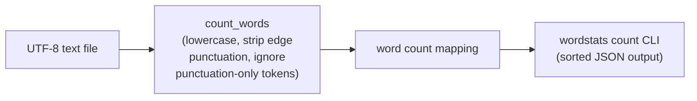

# wordstats - as-is

## Purpose

Count word frequencies in UTF-8 text: a reusable counting library (`count_words`) and the `wordstats count` CLI that prints the counts as sorted, indented JSON.

## Design

The package splits responsibility in two: `counter.py` tokenizes (lowercase, strip punctuation from token edges, ignore punctuation-only tokens) and returns a count mapping; `cli.py` reads the input file, invokes the counter, and prints the mapping plus a `"total"` key (the sum of all per-word counts) as JSON with alphabetically sorted keys and 2-space indent. The public contract is owned by `records/owners/core-utility.md`; user-visible behavior decisions are recorded in `docs/design-notes.md` before bounded changes.

**Lineage**: [as-is](../../as-is.md#design) / **wordstats**

### Count pipeline flow

## Relationships

- The CLI output is the subject of the deterministic smoke check in `checks/validate.sh` (compared against `checks/expected-count.json`) and of the unit tests in `tests/test_counter.py`; both are validation consumers, not owned artifacts.

## Links

- `Owner record: core utility` → `records/owners/core-utility.md` — defines the public contract this component implements.
- `Design notes` → `docs/design-notes.md` — user-visible behavior decisions are recorded here before bounded changes.