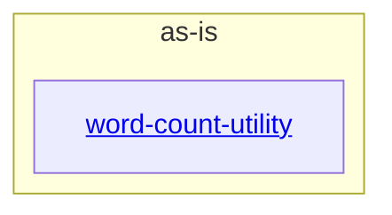

# as-is - as-is

## Purpose

Durable architecture context for the wordstats benchmark seed project: a tiny word-count library and CLI maintained as a fixed, reproducible fixture.

## Components

| Component | Purpose |
| --- | --- |
| [`word-count-utility`](src/wordstats/as-is.md#design) | Word-count library (`count_words`) and the `wordstats count` CLI that reports frequencies as key-sorted JSON. |

## Design

The project declares a single utility component; the root owns documentation, validation, sample data, and records, and no other component boundaries are declared.

**Lineage**: **as-is**

### Structural container

- `word-count-utility` owns all runtime behavior under `src/wordstats/`.
- `checks/validate.sh` is the deterministic acceptance check for every change: compile, unit tests, and a CLI smoke check against `checks/expected-count.json`.
- `tests/`, `checks/`, `sample-data/`, `docs/`, and `records/` are root-owned artifacts, not components.

## Relationships

| Counterparty | Relationship |
| --- | --- |
| Benchmark harness | Consumes the seed as a fixed fixture; harness state is never encoded in this record. |

## Links

- `records/ownership-map.md` → `records/ownership-map.md` — scope-resolution rules; changes in areas without an owner record stop for direction unless explicitly authorized by the governing request.